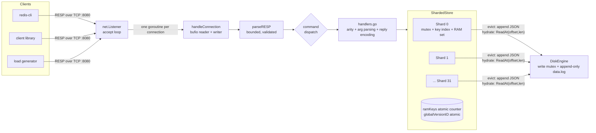
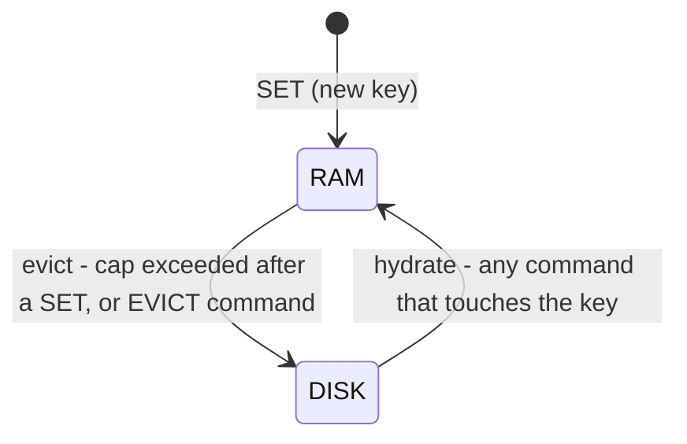
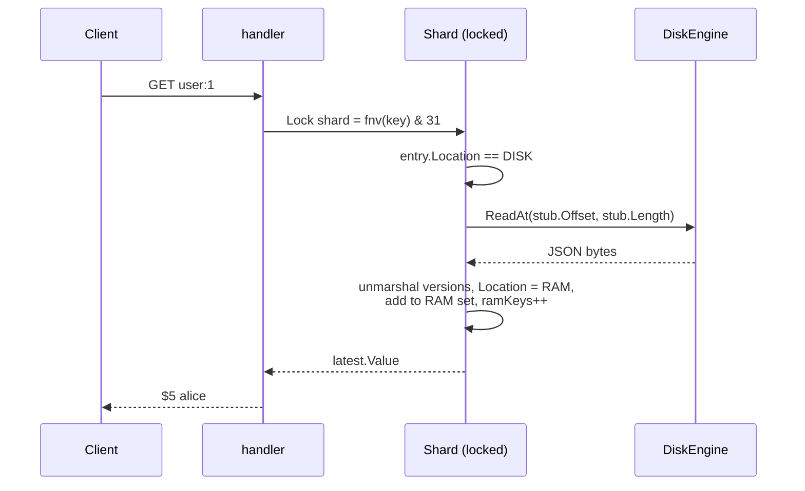

# REO

[](https://github.com/v9shal/REO/actions/workflows/ci.yml)

**A Redis-protocol key-value server written in Go, with tiered RAM → disk storage, per-key version history, point-in-time reads and rollback.**

REO speaks the Redis wire protocol (RESP) over TCP, so `redis-cli` and ordinary Redis client libraries can talk to it. Under the hood it is a 32-shard in-memory store that spills cold keys to an append-only log on disk, keeps the last 5 versions of every key, and lets you ask *"what was this key at time T?"* or *"put it back the way it was"*.

It was built as a systems-programming project: concurrency, a hand-written protocol parser, a storage engine with an eviction policy, and a test/benchmark harness that found and fixed real bugs along the way (see [Bugs found and fixed](#bugs-found-and-fixed)).

> **Status:** educational / portfolio project. It is not a Redis replacement. Read [Known limitations](#known-limitations) before relying on it for anything.

---

## Table of contents

1. [Problems it solves, and how](#problems-it-solves-and-how)
2. [Features](#features)
3. [Quick start](#quick-start)
4. [Command reference](#command-reference)
5. [Architecture](#architecture)
   - [System overview](#system-overview)
   - [Project layout](#project-layout)
   - [Request lifecycle](#request-lifecycle)
   - [Data model](#data-model)
   - [Sharding and locking](#sharding-and-locking)
   - [Tiered storage (RAM ↔ disk)](#tiered-storage-ram--disk)
   - [Eviction algorithm](#eviction-algorithm)
   - [On-disk format](#on-disk-format)
   - [Versioning, AS.OF and ROLLBACK](#versioning-asof-and-rollback)
   - [Expiry](#expiry)
   - [Wire protocol and parser](#wire-protocol-and-parser)
6. [Design decisions and trade-offs](#design-decisions-and-trade-offs)
7. [Testing](#testing)
8. [Benchmarks](#benchmarks)
9. [Bugs found and fixed](#bugs-found-and-fixed)
10. [Known limitations](#known-limitations)


---

## Problems it solves, and how

| Problem | How REO addresses it |
|---|---|
| **The dataset is bigger than the RAM you want to spend.** A pure in-memory store needs RAM for every key *and* value. | **Tiered storage.** Only a soft-capped number of keys keep their values in RAM. Colder keys are serialized to an append-only log and replaced in memory by a tiny pointer (`offset`, `length`). They are transparently pulled back on access. RAM holds the *index*, not the data. |
| **One global lock makes a multi-core machine behave like a single core.** | **Sharding.** Keys are hashed (FNV-1a) into 32 independent shards, each with its own mutex and map, so operations on different shards never contend. |
| **Accidental overwrites and deletes are unrecoverable.** | **Version history.** Every `SET`, `DEL` (tombstone) and `ROLLBACK` appends a new immutable version; the last 5 are kept. `ROLLBACK` restores an old value without rewriting history. |
| **"What was the value at 14:03 yesterday?"** Debugging and auditing need time travel. | **`AS.OF key <unix-nanos>`** binary-searches the version list for the version that was current at that instant. |
| **Cached data must expire.** | **`EXPIRE` / `TTL`** with lazy expiry checked on read. |
| **Every new store needs a new client library.** | **Speaks RESP**, so existing Redis tooling (`redis-cli`, client libraries for the supported commands) works unchanged. |
| **Evicting to disk can quietly destroy performance or memory bounds.** | A **sampled-LRU eviction** over a small per-shard "RAM set" keeps eviction O(1) regardless of how many keys live on disk, and a regression test asserts the RAM accounting never drifts. |

---

## Features

- RESP-compatible TCP server (pipelining supported; verified with `redis-cli`)
- 32-shard concurrent in-memory store, one mutex per shard
- Tiered RAM → disk storage with transparent promotion on access
- Sampled-LRU eviction with a configurable soft RAM cap (`REO_MAX_RAM_KEYS`)
- Per-key history of the last 5 versions, tombstones for deletes
- `HISTORY`, `AS.OF` (point-in-time read) and `ROLLBACK`
- `EXPIRE` / `TTL` with lazy expiry, preserved across eviction
- Graceful shutdown on `SIGINT` / `SIGTERM`
- Hardened parser (bounded argument count and bulk-string size; malformed input drops only that connection)
- 25 tests: end-to-end over real TCP, concurrency, race-detector clean, plus a tiered-storage performance report

---

## Quick start

**Requirements:** Go (see `go.mod`), Linux/macOS. `redis-cli` is optional.

```bash
git clone https://github.com/v9shal/REO.git
cd REO
go build -o reo .
./reo                      # listens on :8080, uses ./data.log
```

Talk to it with `redis-cli`:

```text
$ redis-cli -p 8080
127.0.0.1:8080> PING
PONG
127.0.0.1:8080> SET user:1 alice
OK
127.0.0.1:8080> SET user:1 bob
OK
127.0.0.1:8080> SET user:1 carol
OK
127.0.0.1:8080> HISTORY user:1
1) "v1 | 1791008633542721150 | alice"
2) "v2 | 1791008633548019136 | bob"
3) "v3 | 1791008633552446659 | carol"
127.0.0.1:8080> ROLLBACK user:1 1
OK
127.0.0.1:8080> GET user:1
"alice"
127.0.0.1:8080> EVICT user:1          # push it to the disk tier
OK
127.0.0.1:8080> GET user:1            # transparently read back from disk
"alice"
127.0.0.1:8080> DEL user:1
(integer) 1
127.0.0.1:8080> GET user:1
(nil)
```

Or speak raw RESP with `nc`:

```bash
printf '*3\r\n$3\r\nSET\r\n$5\r\nhello\r\n$5\r\nworld\r\n*2\r\n$3\r\nGET\r\n$5\r\nhello\r\n' | nc -q1 127.0.0.1 8080
# +OK
# $5
# world
```

### Configuration

| Setting | Default | Description |
|---|---|---|
| `REO_MAX_RAM_KEYS` (env) | `5` | Soft cap on keys whose values are held in RAM. Colder keys spill to disk. A tiny default is deliberate: it forces nearly everything through the disk tier, which is what the tests and benchmarks exercise. For a realistic hot-set-in-RAM setup use e.g. `REO_MAX_RAM_KEYS=100000`. |
| Listen address | `:8080` | Hard-coded in `main.go`. |
| Data file | `./data.log` | Created in the working directory. |

```bash
REO_MAX_RAM_KEYS=100000 ./reo
```

---

## Command reference

Commands are case-insensitive. Keys and values are arbitrary strings (binary-safe bulk strings, including spaces and CRLF).

| Command | Reply | Description |
|---|---|---|
| `PING [msg]` | `+PONG` or bulk `msg` | Liveness check. |
| `SET key value` | `+OK` | Create or overwrite. Appends a new version. A new version carries **no TTL**. |
| `GET key` | bulk string or null | Latest value; null if missing, deleted or expired. |
| `DEL key` | `:1` or `:0` | Appends a tombstone version. `:0` if missing, already deleted or expired. |
| `EXISTS key` | `:1` or `:0` | Whether `GET` would return a value. |
| `EXPIRE key seconds` | `:1` or `:0` | Set a TTL on the latest version. `:0` if the key is missing, deleted or expired. |
| `TTL key` | integer | Remaining seconds; `-1` = no expiry; `-2` = missing/deleted/expired. |
| `HISTORY key` | array of bulk strings | Up to 5 entries, oldest first, formatted `v<id> \| <unix-nanos> \| <value>` (`[DELETED]` for tombstones). Empty array if the key is unknown. |
| `AS.OF key unix_nanos` <br> (alias `ASOF`) | bulk string or null | Value that was current at that instant. Null if the key did not exist yet, was deleted, had expired, or the instant is older than the oldest retained version. |
| `ROLLBACK key version_id` | `+OK` or `-ERR` | Appends a **new** version whose value equals the target version's value. Fails if the version is unknown/evicted from history, or is a tombstone. |
| `EVICT key` | `+OK` | Manually move a key's data to the disk tier (no-op if absent or already on disk). Useful for testing and warm-up control. |

Errors use the standard `-ERR ...` form: unknown commands, wrong argument counts, non-integer arguments.

---

## Architecture

### System overview



### Project layout

```text
REO/
├── main.go             # listener, accept loop, graceful shutdown, per-connection command loop
├── parser.go           # RESP request parser (array of bulk strings), with size limits
├── handlers.go         # one handler per command: validates args, calls the store, encodes the reply
├── store.go            # ShardedStore: sharding, versioning, expiry, tiering, eviction
├── disk.go             # DiskEngine: append-only log, offset/length stubs, JSON (de)serialisation
├── server_test.go      # end-to-end tests over real TCP + white-box invariant tests
├── tier_report_test.go # tiered-storage throughput/latency report (this README's benchmark numbers)
└── bench/              # (optional) standalone RESP load generator for stress-testing the server binary
```

### Request lifecycle

1. `main.go` accepts a TCP connection and starts a goroutine running `handleConnection`.
2. The connection gets a buffered reader and writer. Because the reader is buffered, clients may **pipeline** many commands in one write.
3. `parseRESP` reads one command: `*<n>\r\n` followed by *n* bulk strings `$<len>\r\n<bytes>\r\n`.
4. The command name is upper-cased and dispatched to a handler, which validates arity, parses numeric arguments and calls the store.
5. The store hashes the key (`FNV-1a & 31`), locks that one shard, does the work (hydrating from disk if needed) and unlocks.
6. The handler encodes a RESP reply into the buffered writer; the loop flushes after each command, so replies leave in request order.
7. On any parse error the connection is closed. Other connections and the server are unaffected.

### Data model

```text
ShardedStore
├── shards [32]Shard
│     ├── mu   sync.RWMutex
│     ├── mem  map[key] → *KeyEntry         # index of EVERY key (RAM or disk)
│     └── ram  map[key] → {}                # subset of mem whose data is in RAM
├── globalVersionID  atomic.Uint64          # monotonic id source for versions
├── ramKeys          atomic.Int64           # number of keys currently in RAM
└── disk             *DiskEngine

KeyEntry
├── Location      RAM | DISK
├── Versions      []Version                 # populated only when Location == RAM (max 5)
├── Stub          {Offset int64, Length uint32}   # populated only when Location == DISK
└── LastAccessed  int64 (unix nanos)        # drives LRU eviction

Version
├── VersionId     uint64   # globally unique, increasing
├── Timestamp     int64    # unix nanos when written
├── Value         string
├── IsTombStone   bool     # true for DEL
└── ExpiresAt     int64    # unix nanos; 0 = never
```

The in-memory index (`mem`) always holds an entry for every key ever written, so memory use is O(number of keys) for the index plus O(RAM cap) for values.

### Sharding and locking

- **Hash:** FNV-1a (32-bit), masked with `NumShards-1`. `NumShards` must stay a power of two (32).
- **One mutex per shard.** Operations on different shards run fully in parallel.
- **`Get` takes the exclusive lock, not a read lock.** Even a read can mutate state (hydration from disk, `LastAccessed`), so a read lock would be unsafe. This is a conscious trade-off; see [Design decisions](#design-decisions-and-trade-offs).
- **Lock order is trivially acyclic:**
  - A goroutine holds **at most one shard lock** at a time.
  - Inside a shard lock it may take the disk write mutex (`shard.mu → disk.mu`); nothing ever takes them in the opposite order.
  - `Set` releases its shard lock *before* triggering eviction, so eviction (which locks other shards) can never deadlock against it.
  - The locked section of `Set` runs inside a closure with `defer Unlock()` so *every* return path releases the lock (a previous version leaked the lock on the error path, see [Bugs found and fixed](#bugs-found-and-fixed)).
- **Version ids** come from one atomic counter and are assigned while the shard lock is held, so ids within a key are strictly increasing in history order.

### Tiered storage (RAM ↔ disk)



- **RAM state:** `Versions` holds up to 5 versions; `Stub` is unused.
- **Disk state:** `Versions` is `nil` (memory freed); `Stub` points at the serialized version list in `data.log`.
- **Hydration** reads the bytes with `ReadAt(offset, length)`, deserializes them, restores `Versions`, flips the key back to RAM and updates the counters.

A cold `GET` looks like this:



### Eviction algorithm

Triggered at the end of every `SET` (after its shard lock is released) when `ramKeys > REO_MAX_RAM_KEYS`:

1. Pick a **random starting shard** and walk forward (wrapping) until a shard whose **RAM set** is non-empty is found. (Picking just one random shard was a bug: empty shards meant nothing was evicted and the cap silently leaked.)
2. Under that shard's lock, **sample up to 8 keys** from the shard's RAM set. Go randomises map iteration order, so the first few entries are a random sample.
3. Evict the sampled key with the **oldest `LastAccessed`** (approximate LRU, the same idea Redis uses for its sampled LRU).
4. Eviction serialises the key's versions to JSON, appends them to `data.log`, records the new `(offset, length)` stub, frees the in-memory versions, removes the key from the shard's RAM set and decrements `ramKeys`.

Cost per eviction is **O(1)**: it touches only the RAM set (bounded by the cap), never the population of disk-resident keys. An earlier version scanned the entire shard map on every `SET`, which made inserts slow down as the dataset grew (see the bug log).

The cap is **soft**: it is checked after each `SET`, one key is evicted per `SET`, and reads can promote keys without triggering eviction (see [Known limitations](#known-limitations)).

### On-disk format

`data.log` is an **append-only** file opened with `O_APPEND`. Each eviction appends one record:

```text
[ JSON array of Version objects, no framing, no key, no checksum ]
```

e.g. `[{"version_id":2,"timestamp":1791002582771429776,"value":"two","is_tombstone":false,"expires_at":0}]`

- The location of each record is tracked **only in RAM** (`DiskStub`), so the log is not self-describing and cannot currently be replayed after a restart.
- Writes are serialised by a mutex that also maintains the running offset. Reads use `ReadAt` (`pread`), which is safe to run concurrently with each other and with appends.
- Re-evicting a key writes a new record and orphans the old one. There is no compaction yet. Measured size is about 200 bytes per key for a 100-byte value (JSON field names plus version metadata).

### Versioning, AS.OF and ROLLBACK

- Each key keeps a **sliding window of the 5 most recent versions**; when a 6th is added the oldest is dropped.
- `SET` appends a version. `DEL` appends a **tombstone** version rather than removing the key, which is what makes undelete via `ROLLBACK` and `AS.OF` over deleted periods possible.
- `AS.OF key T`: if `T` is older than the oldest retained version the answer is null; otherwise a binary search (`sort.Search`) finds the last version with `Timestamp <= T`. A tombstone, or a version that had already expired at `T`, yields null.
- `ROLLBACK key id`: finds the version with that id, refuses tombstones, and appends a **new** version with the old value (new id, new timestamp, no TTL). History is never rewritten, so a rollback can itself be rolled back.
- Timestamps are wall-clock `time.Now().UnixNano()`; a backwards clock adjustment can therefore disturb `AS.OF` ordering.

### Expiry

- `EXPIRE` stamps `ExpiresAt` on the **latest version**; it survives eviction because it is part of the serialised version.
- Expiry is **lazy**: a version is treated as expired when read at or after `ExpiresAt`. Expired keys are not proactively reclaimed.
- Like `SET` in Redis without `KEEPTTL`, a new `SET` creates a version with no expiry.

### Wire protocol and parser

REO implements the **client → server** half of RESP2: a command is an array of bulk strings. Replies use simple strings (`+OK`), errors (`-ERR ...`), integers (`:1`), bulk strings (`$5\r\nhello`), null bulk (`$-1`) and arrays (`*N`).

The parser reads exact byte counts rather than scanning for delimiters, so values may contain `\r\n`, spaces or any bytes. It is hardened against hostile input:

- the array length must be in `[0, 1024]`
- each bulk string length must be in `[0, 64 MiB]`
- anything malformed closes **that connection only**; a regression test guards against the old behaviour where a negative length (`$-1`) panicked the whole server process

---

## Design decisions and trade-offs

| Decision | Why | Cost / alternative |
|---|---|---|
| **32 shards with one mutex each** | Simple, predictable, removes the global-lock bottleneck. | More shards or lock-free structures could scale further; hot keys still serialize on one shard. |
| **Exclusive lock for `GET`** | Reads mutate state (hydration, LRU timestamp), so `RLock` would be a data race. | Concurrent reads of the same shard serialize. Fix: separate a cheap read path for RAM-resident keys. |
| **Index of all keys stays in RAM** | Lookups never need a disk seek just to learn a key exists or where it lives. | RAM is O(keys). A disk-resident index (LSM / B-tree) would remove that bound. |
| **Append-only log + stub pointers** | Sequential writes are fast; random reads are one `pread`. | No in-place update, so stale records accumulate until compaction exists. |
| **JSON for on-disk records** | Easy to debug and evolve while the design was settling. | About 200 bytes per key and slower than a binary encoding. |
| **Sampled LRU over a per-shard RAM set** | O(1) eviction and no global ordering structure to lock. | Approximate, not exact LRU. |
| **Soft RAM cap, checked after `SET`** | Keeps the write path cheap and lock-simple. | Reads can push RAM above the cap. |
| **Tombstones + capped history** | Gives undelete and time-travel with bounded memory. | History older than 5 versions is gone. |
| **Evict after releasing the shard lock** | Guarantees no two shard locks are ever held together, so no lock-ordering deadlocks. | The cap can be exceeded briefly under concurrency. |

---

## Testing

```bash
go test -race -count=1 ./...                         # everything
go test -race -count=1 -skip TestTieredStorageReport ./...   # fast correctness suite only
go test -short ./...                                 # skip the test that sleeps ~1.2s for real expiry
```

(`-race` needs a C toolchain; drop it if `gcc` is unavailable.)

`server_test.go` starts a real TCP listener running the real `handleConnection`, so tests exercise parser, handlers, store and disk together:

| Area | What is covered |
|---|---|
| Commands | `PING`, `SET`/`GET`/overwrite, `DEL`/`EXISTS`, `EXPIRE`/`TTL` (including real expiry and TTL surviving eviction), `HISTORY` (5-version cap, tombstones), `AS.OF`, `ROLLBACK` (including rejecting tombstones/unknown ids), `EVICT` then read |
| Values | spaces, empty values, embedded `\r\n`, RESP-looking payloads, Unicode, a 1 MiB value through eviction |
| Protocol | unknown commands, wrong arity, non-integer args, pipelining of 400 commands, a command delivered one byte per TCP write, garbage input closing only that connection |
| Concurrency | 32 clients writing/overwriting/randomly evicting their own key ranges then verifying every value; 16 clients hammering a single hot key and asserting version ids stay strictly increasing |
| Invariants (regression) | the RAM counter equals the true number of RAM-resident keys after SETs, evictions, hydrations and deletes; a failed `SET` never leaves a shard locked; a negative bulk length never panics the parser |

---

## Benchmarks

`tier_report_test.go` inserts N keys, forces them to the disk tier, then reads them back from disk and from RAM, verifying **every value read**. It reports throughput and latency percentiles at two levels: **store level** (no network) and **end-to-end over TCP** (RESP, 32 connections, one request in flight per connection).

```bash
go test -run TestTieredStorageReport -v -count=1 -timeout 30m                    # 100,000 keys
REO_KEYS=1000000 go test -run TestTieredStorageReport -v -count=1 -timeout 30m   # 1,000,000 keys
```

Knobs: `REO_KEYS`, `REO_VALUE_SIZE` (default 100), `REO_WORKERS` (default 8), `REO_CONNS` (default 32), `REO_MAX_RAM_KEYS` (default 5). The report is also written to `reo_report.txt`.

### Results

Measured on the author's machine: Linux amd64, 12 logical CPUs, Go 1.27.1. 100-byte values, RAM cap = 5 keys, so after the insert phase 5 keys are in RAM and 999,995 of 1,000,000 are on disk.

**1,000,000 keys: 3,000,000 reads verified, 0 wrong**

| Phase | ops/sec | avg | p50 | p95 | p99 |
|---|---:|---:|---:|---:|---:|
| Store: insert (1 goroutine) | 176,047 | 5.6 µs | 4.6 µs | 9.5 µs | 16.6 µs |
| Store: cold read from disk (1 goroutine) | 126,845 | 7.8 µs | 6.2 µs | 12.7 µs | 22.0 µs |
| Store: cold read from disk (8 goroutines) | 442,402 | 17.8 µs | 12.0 µs | 32.1 µs | 133.4 µs |
| Store: warm read from RAM (1 goroutine) | 472,206 | 2.0 µs | 1.7 µs | 3.1 µs | 7.3 µs |
| TCP: insert (32 conns) | 107,674 | 295 µs | 200 µs | 780 µs | 1.69 ms |
| TCP: cold read from disk (32 conns) | 127,872 | 249 µs | 207 µs | 482 µs | 1.02 ms |
| TCP: warm read from RAM (32 conns) | 163,958 | 194 µs | 169 µs | 347 µs | 558 µs |

`data.log` after 1M keys: 192.5 MB (about 202 bytes per key).

**100,000 keys** gives the same picture (insert 175,553 ops/sec; cold read 161,002 ops/sec with p99 15.2 µs; TCP cold read 142,065 ops/sec with p99 0.68 ms), showing that insert throughput **does not degrade as the dataset grows**.

### How to read these numbers honestly

- **"Disk" reads are served mostly from the OS page cache.** The 192 MB log fits comfortably in memory, so these are not raw SSD latencies. They measure REO's disk-tier code path (lookup, `pread`, JSON decode, promote), not storage hardware.
- **No `fsync`.** Writes reach the kernel's page cache, not necessarily the platter/flash. Do not read the insert numbers as durable-write throughput.
- **Loopback TCP, shared CPU.** The load generator and server run on the same machine and compete for the same cores.
- **One request in flight per connection** (no pipelining in the benchmark), so TCP numbers reflect round-trip latency, not peak pipelined throughput.
- **Single run on one machine.** Treat the figures as order-of-magnitude, not guarantees; use the median of several runs when quoting them.

---

## Bugs found and fixed

The test and benchmark harness earned its keep. These were real defects found by writing invariants and measuring:

| # | Bug | Symptom | Fix |
|---|---|---|---|
| 1 | **RAM counter drift in `Set`.** Promoting a disk-resident key back to RAM did not increment `ramKeys`. | Counter said 5 while all 2,000 test keys were in RAM; the RAM cap silently stopped working and memory grew unbounded. | Count the promotion; an invariant test now compares the counter to the true RAM population after every kind of operation. |
| 2 | **`Del` incremented the RAM counter** for a tombstone that adds no RAM-resident key. | Counter inflation, extra evictions. | Removed. |
| 3 | **Leaked shard lock in `Set`.** A disk read error returned while still holding the shard mutex. | Every later operation on that shard hung forever. | Locked section moved into a closure with `defer Unlock()`; regression test with a corrupted stub. |
| 4 | **Parser panic on negative bulk length** (`$-1`). `make([]byte, -1)` panics inside a connection goroutine. | One malformed packet crashed the entire server. | Validate array/bulk lengths against `[0, max]`; regression test. |
| 5 | **O(n) eviction.** The victim search walked every key in a shard, including all disk-resident ones. | Insert throughput fell from about 53k to 14k to 3k ops/sec as the dataset grew from 50k to 200k keys. | Per-shard RAM set + 8-key sampled LRU: O(1) eviction. Insert is now flat at about 175k ops/sec from 100k to 1M keys. |
| 6 | **Soft cap leaked.** Eviction tried one random shard; if it had no RAM keys nothing was evicted. | With a cap of 5, about 1,000 to 2,000 keys stayed in RAM and the number grew with N. | Walk shards from a random start until one has something to evict. RAM-resident is now exactly the cap. |

---

## Known limitations

Being explicit about what REO does **not** do:

- **No crash recovery / persistence across restarts.** The key → offset index lives only in RAM and the log has no framing, keys or checksums, so `data.log` cannot be replayed. On restart the old log is appended to but its contents are unreachable.
- **No `fsync`.** There is no durability guarantee.
- **No compaction.** Re-evicting a key orphans its old record; the log only grows.
- **Eviction only runs after `SET`.** A read-heavy workload can promote cold keys into RAM without bound, exceeding the cap. (`GET` does not trigger eviction.)
- **Index is O(keys) in RAM**, and deleted keys keep their tombstone entry forever; expired keys are never reclaimed.
- **`GET` uses an exclusive shard lock**, so concurrent reads within a shard are serialised.
- **Strings only**, no lists/hashes/sets, no transactions, no pub/sub, no replication, no authentication, no TLS.
- **Subset of Redis.** About ten commands, RESP2 requests only; do not claim Redis compatibility beyond these commands.
- **Port and file path are hard-coded** (`:8080`, `./data.log`).
- **No connection limits or idle timeouts** beyond what the OS provides.
- **Wall-clock timestamps** are used for versions and `AS.OF`.

---
## License

This project is licensed under the MIT License - see the [LICENSE](LICENSE) file for details.